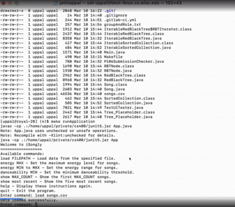
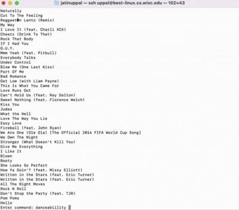

<div id="top">

<!-- HEADER STYLE: CLASSIC -->
<div align="center">


# UW-MADISON-SP-25-SONG-LIBRARY

<em>Unleashing Music’s Power Through Smarter Search</em>

<!-- BADGES -->


<em>Built with the tools and technologies:</em>


</div>
<br>

---

## Table of Contents

- [Overview](#overview)
- [Getting Started](#getting-started)
    - [Prerequisites](#prerequisites)
    - [Installation](#installation)
    - [Usage](#usage)
    - [Testing](#testing)

---

## Overview

UW-Madison-SP-25-Song-Library is a developer-focused tool designed to efficiently manage and query a collection of songs, supporting dynamic filtering by attributes like energy, danceability, and recency. Built on a balanced Red-Black Tree, it ensures fast, reliable operations even with large datasets. The project emphasizes modularity, with clear interfaces for backend and frontend components, making it ideal for scalable music data applications. Comprehensive testing guarantees robustness, while scripts facilitate organized development workflows.

**Why UW-Madison-SP-25-Song-Library?**

This project provides a high-performance backend system for managing music metadata with flexible, range-based filtering. The core features include:

- 🧩 **🧠 Efficient Data Structures:** Implements a self-balancing Red-Black Tree for quick insertions, deletions, and lookups.
- 🎯 **🔍 Dynamic Filtering:** Supports filtering songs by energy, danceability, and recency, tailored to user preferences.
- 🚀 **🔄 Range Iteration:** Enables range-limited traversal over sorted collections for precise data access.
- 🛠️ **🧩 Modular Architecture:** Clear interfaces for backend and frontend facilitate seamless integration and testing.
- ✅ **🧪 Robust Testing:** Comprehensive unit and integration tests ensure reliability and correctness.

---

## 🎥 Demo Preview




> 🔗 [Watch full demo video on MediaSpace (1 min)]([https://mediaspace.wisc.edu/media/CS400%20P2%20Demo/1_dvsuxgn2](https://mediaspace.wisc.edu/media/CS400%20P1%20Demo/1_k4nutf2w))

---

## Getting Started

### Prerequisites

This project requires the following dependencies:

- **Programming Language:** Java
- **Package Manager:** Maven

### Installation

Build UW-Madison-SP-25-Song-Library from the source and install dependencies:

1. **Clone the repository:**

    ```sh
    ❯ git clone https://github.com/JatUppal/UW-Madison-SP-25-Song-Library
    ```

2. **Navigate to the project directory:**

    ```sh
    ❯ cd UW-Madison-SP-25-Song-Library
    ```

3. **Install the dependencies:**

**Using [maven](https://maven.apache.org/):**

```sh
❯ mvn install
```
**Using [maven](https://maven.apache.org/):**

```sh
❯ mvn install
```

### Usage

Run the project with:

**Using [maven](https://maven.apache.org/):**

```sh
mvn exec:java
```
**Using [maven](https://maven.apache.org/):**

```sh
mvn exec:java
```

### Testing

Uw-madison-sp-25-song-library uses the {__test_framework__} test framework. Run the test suite with:

**Using [maven](https://maven.apache.org/):**

```sh
mvn test
```
**Using [maven](https://maven.apache.org/):**

```sh
mvn test
```

---

<div align="left"><a href="#top">⬆ Return</a></div>

---
